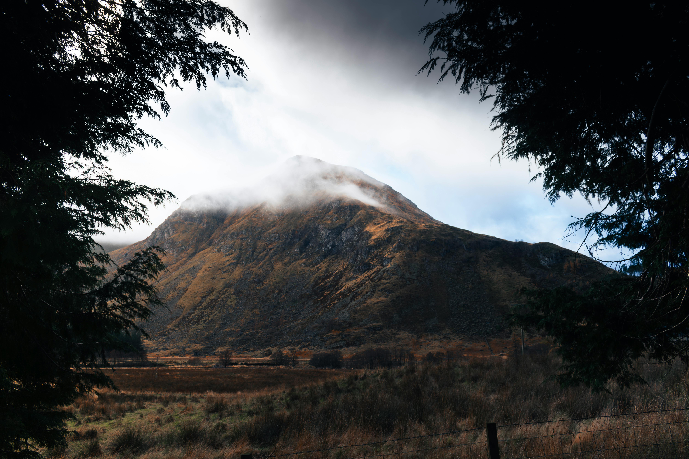

# ATP Kolokvij

## Dalí je u povijesti zapamćen po svojim snažnim i bizarnim slikama te kao jedan od najpoznatijih predstavnika nadrealizma u slikarstvu, a mnogi stručnjaci smatraju da su na njegov stil utjecali renesansni majstori.



```
export class UserBookmark extends DurableObject {

  constructor( ctx, env ) {
    
    super(ctx, env);
    
    this.storage = ctx.storage;
    this.localSql = ctx.storage.sql;

    this.localSql.exec(`CREATE TABLE IF NOT EXISTS bookmark(
```

### Popis resursa
- [Tekst](https://hr.wikipedia.org/wiki/Glavna_stranica)
- [Slika](https://www.pexels.com/photo/misty-mountain-framed-by-evergreen-trees-30283157/)

### Numerirani popis
?

| | | |
| - | - | - |
|Naziv|verzija|autor|
|ATP kolokvij|1.0|Dominik Juricic|
